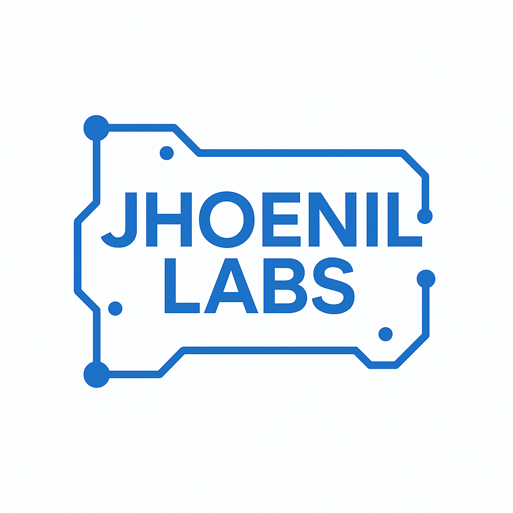

# Jhoenil Labs

[](https://app.netlify.com/projects/jhoenil-labs/deploys)




## Project Overview

**Jhoenil Labs** is the portfolio of Jhoenil Wahid, a senior software engineer and consultant specializing in helping businesses leverage modern technology. My expertise includes web and mobile development, DevOps, technical leadership, AI-powered solutions, and data engineering. I am passionate about building scalable systems, streamlining operations through automation, and creating impactful technology solutions that lead to tangible business growth.

## Project Info

**URL**: [https://jhoenil-labs.netlify.app/](https://jhoenil-labs.netlify.app/)

## Features

- **Responsive Design**: Optimized for both mobile and desktop devices.
- **Modern UI Components**: Built with reusable and accessible components.
- **Fast Development**: Leveraging Vite for quick builds and hot module replacement.
- **Customizable**: Easily extendable for new features and designs.
- **SEO Optimized**: Includes meta tags and sitemap for better search engine visibility.
- **Progressive Web App (PWA)**: Installable on mobile devices.

## Tech Stack

This project is built with:

- [Vite](https://vitejs.dev/): For fast development and optimized builds.
- [TypeScript](https://www.typescriptlang.org/): For type safety and better developer experience.
- [React](https://react.dev/): UI library for building component-based interfaces.
- [Tailwind CSS](https://tailwindcss.com/): Utility-first CSS framework for styling.
- [shadcn/ui](https://shadcn.dev/): Reusable component library built on Radix UI.
- [Bun](https://bun.sh/): JavaScript runtime and package manager.
- [PostCSS](https://postcss.org/): For CSS processing and optimization.
- [ESLint](https://eslint.org/): For code quality and consistency.

## How to Edit This Code

### Use Your Preferred IDE

If you want to work locally using your own IDE, you can clone this repo and push changes. Pushed changes will also be reflected in your deployment.

The only requirement is having Node.js & Bun installed - [install Bun](https://bun.sh/)

Follow these steps:

```sh
# Step 1: Clone the repository using the project's Git URL.
git clone <YOUR_GIT_URL>

# Step 2: Navigate to the project directory.
cd <YOUR_PROJECT_NAME>

# Step 3: Install the necessary dependencies.
bun install

# Step 4: Start the development server with auto-reloading and an instant preview.
bun dev
```

## Deployment

The app is deployed on Netlify as a Single Page Application (SPA). To deploy:

```sh
# Build the project
bun run build

# The build output will be in the dist/ directory
```

You can deploy to Netlify through:
1. Connecting your GitHub repository to Netlify.
2. Setting the build command to `bun run build`.
3. Setting the publish directory to `dist`.
4. Ensuring the `_redirects` file is present in the public directory for proper SPA routing.

The app will be automatically deployed on every push to the main branch.

## Contact

For inquiries or collaboration opportunities, please email:
[aljhoenilw@gmail.com](mailto:aljhoenilw@gmail.com)
